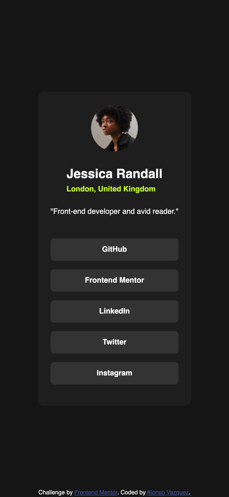

# Frontend Mentor - Social links profile solution

This is a solution to the [Social links profile challenge on Frontend Mentor](https://www.frontendmentor.io/challenges/social-links-profile-UG32l9m6dQ). Frontend Mentor challenges help you improve your coding skills by building realistic projects. 

## Table of contents

- [Overview](#overview)
  - [The challenge](#the-challenge)
  - [Screenshot](#screenshot)
  - [Links](#links)
- [My process](#my-process)
  - [Built with](#built-with)
  - [What I learned](#what-i-learned)
  - [Continued development](#continued-development)
  - [Useful resources](#useful-resources)
- [Author](#author)

## Overview

### The challenge

Users should be able to:

- See hover and focus states for all interactive elements on the page

### Screenshot

### Links

- Solution URL: [Add solution URL here](https://your-solution-url.com)
- Live Site URL: [Add live site URL here](https://your-live-site-url.com)

## My process

### Built with

- Semantic HTML5 markup
- CSS custom properties
- Flexbox
- CSS Grid
- Mobile-first workflow

### What I learned

I learned how to add custom fonts to projects using `ttf` local files. Also I learned how to structure my CSS code better in order to create helper classes to make them re-usable.

### Continued development

I'd like to create a whole project out of this. Like use React.js to create a front-end and add icons to the social media links and create a back-end to control the links displayed. Add features to support users and more!

### Useful resources

- [Digital Ocean - CSS font face](https://www.digitalocean.com/community/tutorials/css-font-face) - This helped me to understand how to add a custom `font-face`, set their proper weights and even to how to control font loading (not using in this project tho).

## Author

- Website - [Alonso Vazquez](https://github.com/alonsovzqz)
- Frontend Mentor - [@alonsovzqz](https://www.frontendmentor.io/profile/alonsovzqz)
